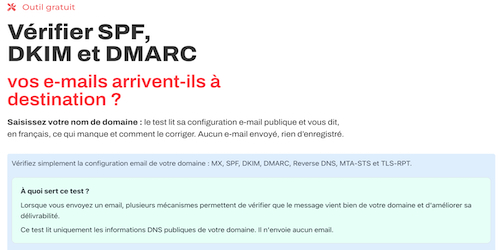

# 

## Auteur

👤 **Thierry LAVAL** — [Contact](mailto:contact@thierrylaval.dev)

* Github : [@Thierry Laval](https://github.com/thierry-laval)
* LinkedIn : [Thierry Laval](https://www.linkedin.com/in/thierry-laval)
* Site Web : https://thierrylaval.dev

---

## 📎 Projet

Outil de Vérification E-mail & DNS — Fichier Unique Autonome

_`Début du projet le 30/09/2025`_ — Version du script : 1.0.0 (25/09/2026)



---

<details open="open">
  <summary><h2>Table des matières</h2></summary>
  <ol>
    <li><a href="#à-propos-du-projet">À propos du projet</a>
      <ul>
        <li><a href="#construit-avec">Construit avec</a></li>
      </ul>
    </li>
    <li><a href="#architecture-des-fichiers">Architecture des fichiers</a></li>
    <li><a href="#commencer-à-travailler">Commencer à travailler</a>
      <ul>
        <li><a href="#conditions-préalables">Conditions préalables</a></li>
        <li><a href="#installation-ultra-simple">Installation ultra-simple</a></li>
        <li><a href="#personnalisation-facultative">Personnalisation facultative</a></li>
      </ul>
    </li>
    <li><a href="#fonctionnalités-détaillées">Fonctionnalités détaillées</a>
      <ul>
        <li><a href="#mx-reverse-dns-et-cname-racine">MX, Reverse DNS et CNAME racine</a></li>
        <li><a href="#spf">SPF</a></li>
        <li><a href="#dkim">DKIM</a></li>
        <li><a href="#dmarc">DMARC</a></li>
        <li><a href="#listes-noires-anti-spam-rbl">Listes Noires Anti-Spam (RBL)</a></li>
        <li><a href="#dnssec">DNSSEC</a></li>
        <li><a href="#bimi">BIMI</a></li>
        <li><a href="#dane--tlsa">DANE / TLSA</a></li>
        <li><a href="#mta-sts--tls-rpt">MTA-STS & TLS-RPT</a></li>
      </ul>
    </li>
    <li><a href="#nouvelles-fonctionnalités">Nouvelles fonctionnalités</a></li>
    <li><a href="#utilisation">Utilisation</a></li>
    <li><a href="#score-de-sécurité">Score de sécurité</a></li>
    <li><a href="#sécurité-intégrée">Sécurité intégrée</a></li>
    <li><a href="#compatibilité">Compatibilité</a></li>
    <li><a href="#structure-du-json-retourné">Structure du JSON retourné</a></li>
    <li><a href="#glossaire-technique">Glossaire technique</a></li>
    <li><a href="#limites-connues">Limites connues</a></li>
    <li><a href="#feuille-de-route">Feuille de route</a></li>
    <li><a href="#contribution">Contribution</a></li>
    <li><a href="#licence">Licence</a></li>
    <li><a href="#soutien">Soutien</a></li>
  </ol>
</details>

---

## À propos du projet

Cet outil analyse en profondeur la configuration e-mail publique, la réputation et la sécurité DNS d'un nom de domaine **sans envoyer le moindre e-mail** et **sans stocker aucune donnée**.

Conçu sous la forme d'un **fichier unique PHP autonome**, il intègre à la fois le moteur d'analyse backend et l'interface web complète (HTML5, styles CSS responsive, script interactif, export PDF dédié). Il vous suffit de déposer ce fichier à la racine de votre site (ou dans un sous-dossier) pour disposer immédiatement d'un outil d'audit complet accessible via sa propre URL.

Une mauvaise configuration e-mail peut entraîner :

* 📭 Des e-mails légitimes qui arrivent directement en boîte spam
* 🏴‍☠️ Des pirates qui envoient des faux e-mails en usurpant votre identité
* ❌ Des e-mails rejetés par les serveurs de réception (Gmail, Outlook, Yahoo)
* 📉 L'inscription de vos adresses IP sur des listes noires mondiales de spammeurs

### Construit avec

| Technologie | Rôle |
| :-----------: | :----: |
| PHP 7.4+ / 8.x | Moteur d'analyse autonome & API JSON (`verifier-spf-dkim-dmarc.php`) |
| HTML5 / CSS3 / JavaScript Vanilla | Interface utilisateur moderne & responsive (embarquée) |
| DNS natif PHP | Interrogations DNS directes (aucun abonnement ni clé API requis) |
| DNS-over-HTTPS (DoH) | Résolution sécurisée des enregistrements DS (DNSSEC) et TLSA (DANE) |
| cURL | Validation HTTPS de la politique MTA-STS et requêtes DoH |

---

<!-- ARCHITECTURE -->
## Architecture des fichiers

```
P53-script-audit-email-spf-dkim-dmarc/
│
├── verifier-spf-dkim-dmarc.php   ← Fichier UNIQUE autonome (Moteur PHP + Interface Web)
├── README.md                     ← Ce fichier de documentation
├── LICENSE                       ← Licence AFL-3.0 & Avis d'attribution
└── .gitignore                    ← Règles d'exclusion Git
```

### `verifier-spf-dkim-dmarc.php`

Ce fichier est **100% autonome**. Il assure l'ensemble du cycle de vie de l'application :

* **Routage dynamique intelligent** :

  * Lorsqu'il est appelé en **GET**, il génère l'interface HTML complète avec styles CSS, formulaire, animations et contrôles JavaScript.
  * Lorsqu'il reçoit une requête **POST / AJAX**, il agit comme une API REST ultra-rapide et renvoie le rapport sous format JSON structuré.

* **Sécurité et protection native** :

  * Jeton anti-CSRF émis en session PHP pour neutraliser les attaques intersites.
  * Champ Honeypot invisible pour bloquer instantanément les robots spammeurs.
  * Assainissement strict et filtrage des noms de domaine selon les RFC.

* **Auto-ciblage** :

  * Le JavaScript détecte automatiquement l'URL du fichier hôte (`window.location.href.split('?')[0]`). Vous pouvez donc renommer le fichier ou le placer dans n'importe quel dossier sans modifier une seule ligne de code.

---

## Commencer à travailler

### Conditions préalables

* Un serveur web (Apache, Nginx, LiteSpeed, etc.) avec **PHP 7.4 ou supérieur** (testé jusqu'à PHP 8.5+)
* Extension PHP **`curl`** activée (ou `file_get_contents` avec `allow_url_fopen`)
* Fonction PHP **`dns_get_record`** disponible (standard sur tous les hébergements web)
* Aucun CMS requis, aucune base de données nécessaire !

### Installation ultra-simple

1. Téléchargez ou copiez le fichier `verifier-spf-dkim-dmarc.php`.

2. Déposez-le par FTP, SSH ou via le gestionnaire de fichiers de votre hébergeur (cPanel, Plesk, etc.) à la racine de votre site web :

   ```
   /public_html/verifier-spf-dkim-dmarc.php
   ```

   _(ou dans un sous-dossier de votre choix, par exemple `/outils/verifier-spf-dkim-dmarc.php`)_.

3. Ouvrez votre navigateur et accédez directement à l'adresse :

   ```
   https://votre-site.com/verifier-spf-dkim-dmarc.php
   ```

4. C'est tout ! L'outil est prêt à l'emploi.

### Personnalisation facultative

* **Renommage** : Vous pouvez renommer le fichier comme vous le souhaitez (ex : `audit-email.php`, `securite-dns.php`, `index.php` dans un sous-domaine dédié).
* **Titres et couleurs** : Toutes les règles CSS et les textes sont directement modifiables au sein du fichier unique.

---

## Fonctionnalités détaillées

| Contrôle | Niveau | Rôle et vérification |
| ---------- | -------- | --------------------- |
| **MX & Reverse DNS** | 🔴 Indispensable | Serveurs de réception, PTR, FCrDNS croisé, détection CNAME racine, détection fournisseur (17 services) |
| **SPF** | 🔴 Indispensable | Enregistrement unique, récursion RFC 7208, limite 10 lookups, `+all` dangereux, arbre des `include:` |
| **DKIM** | 🔴 Indispensable | 18 sélecteurs testés automatiquement, taille de clé RSA (1024 bits dépréciée), détection révocation |
| **DMARC** | 🔴 Indispensable | Tags `v p sp pct adkim aspf rua ruf`, héritage sous-domaines, rapports externes RFC 7489 |
| **Listes Noires (RBL)** | 🔴 Indispensable | Réputation anti-spam des IPs des serveurs MX (Spamcop, Barracuda, PSBL, UCEPROTECT) |
| **DNSSEC** | 🟡 Sécurité DNS | Signature cryptographique de la zone DNS contre l'empoisonnement de cache (Cache Poisoning) |
| **BIMI** | 🟡 Optionnel / Marque | Logo SVG officiel, certificat VMC, compatibilité stricte DMARC requise |
| **DANE / TLSA** | 🟡 Optionnel / Avancé | Authentification DNS du certificat SSL/TLS des serveurs de messagerie (port 25) |
| **MTA-STS** | 🟡 Optionnel / Avancé | DNS TXT + vérification HTTPS du fichier `mta-sts.txt`, mode, max_age, liste MX autorisés |
| **TLS-RPT** | 🟡 Optionnel / Avancé | Enregistrement DNS, paramètre de réception des rapports d'échec `rua=` |

---

<a id="mx-reverse-dns-et-cname-racine"></a>

### 🔴 MX, Reverse DNS et CNAME racine

**Ce que ça vérifie :**

* La présence d'enregistrements MX dans le DNS du domaine
* **Contrôle RFC 1034 sur la racine (@)** : alerte immédiate si un enregistrement CNAME a été configuré sur le domaine principal (ce qui neutralise tous les enregistrements MX et SPF)
* L'adresse IP (IPv4 et IPv6) associée à chaque serveur MX
* Le **PTR (Reverse DNS)** : vérifie si un nom d'hôte valide est associé à l'IP
* Le **FCrDNS (Forward-Confirmed Reverse DNS)** : vérifie la réconciliation bidirectionnelle IP ↔ Nom
* La **détection automatique de votre messagerie** parmi 17 fournisseurs répertoriés (Google Workspace, Microsoft 365, OVHcloud, ProtonMail, Infomaniak, Gandi, Brevo, Mailjet, SendGrid, etc.)

---

<a id="spf"></a>

### 🔴 SPF (Sender Policy Framework)

**Ce que ça vérifie :**

* Présence d'un enregistrement SPF **unique** sous forme de TXT
* Détection des **SPF multiples** (erreur critique PermError selon la RFC 7208)
* **Comptage strict des requêtes DNS** (limite maximale de 10)
* **Analyse récursive des `include:`** avec détection des boucles infinies
* Détection des directives dangereuses : `+all` (autorise tout le monde), `?all` (neutre sans protection), `ptr` (déconseillé)
* Affichage de l'**arborescence complète des inclusions**

---

<a id="dkim"></a>

### 🔴 DKIM (DomainKeys Identified Mail)

**Ce que ça vérifie :**

* La présence d'un enregistrement DKIM à l'hôte `sélecteur._domainkey.domaine.com`
* **Découverte automatique parmi 18 sélecteurs courants** si aucun sélecteur n'est spécifié :  
  `default`, `mail`, `email`, `dkim`, `selector1`, `selector2`, `google`, `k1`, `k2`, `s1`, `s2`, `smtp`, `mailjet`, `sparkpost`, `sendgrid`, `mg`, `mandrill`, `pm`
* Analyse des tags : `v=DKIM1`, type de clé (`k=rsa`), clé publique Base64 (`p=`)
* **Taille de clé RSA** : avertissement si la clé est en 1024 bits (dépréciée), recommandation 2048+ bits
* Détection de révocation de clé (`p=` vide)

---

<a id="dmarc"></a>

### 🔴 DMARC (Domain-based Message Authentication, Reporting & Conformance)

**Ce que ça vérifie :**

* Présence de `_dmarc.domaine.com` ou héritage depuis le domaine parent
* Analyse complète des tags : `v`, `p`, `sp`, `pct`, `adkim`, `aspf`, `rua`, `ruf`
* **Vérification de l'autorisation des rapports externes (RFC 7489)** : contrôle que les prestataires tiers autorisent bien la réception des rapports

| Politique | Effet | Recommandation |
| ----------- |------- | ---------------- |
| `p=none` | Surveillance uniquement, aucun blocage | Démarrage recommandé |
| `p=quarantine` | Les faux e-mails vont dans les spams | Intermédiaire sécurisé |
| `p=reject` | Les faux e-mails sont bloqués et détruits | Protection maximale |

---

<a id="listes-noires-anti-spam-rbl"></a>

### 🔴 Listes Noires Anti-Spam (RBL / DNSBL)

**Ce que ça vérifie :**

* Interrogation par DNS inverse des adresses IPv4 de vos serveurs de messagerie (MX)
* Consultation instantanée des principales listes noires publiques :
  * **Spamcop** (`bl.spamcop.net`)
  * **Barracuda Reputation Network** (`b.barracudacentral.org`)
  * **SURRIEL PSBL** (`psbl.surriel.com`)
  * **UCEPROTECT Niveau 1** (`dnsbl-1.uceprotect.net`)
* Tableau détaillé des résultats pour chaque IP avec badge vert `✓ Propre` ou alerte rouge `❌ Listé`

---

<a id="dnssec"></a>

### 🟡 DNSSEC (Domain Name System Security Extensions)

**Ce que ça vérifie :**

* Présence d'enregistrements **DS (Delegation Signer)** dans la zone parente du domaine
* Interrogation via Google Public DNS-over-HTTPS (DoH) pour garantir l'intégrité de la réponse
* Protège contre le DNS Cache Poisoning et les attaques de type Man-in-the-Middle

---

<a id="bimi"></a>

### 🟡 BIMI (Brand Indicators for Message Identification)

**Ce que ça vérifie :**

* Présence de `default._bimi.domaine.com`
* URL HTTPS du logo SVG au format Tiny P.S.
* Détection du certificat de marque vérifiée VMC (`a=`)
* **Vérification de compatibilité DMARC** (nécessite impérativement `p=quarantine` à 100% ou `p=reject`)
* **Prévisualisation directe du logo SVG** dans le rapport

---

<a id="dane--tlsa"></a>

### 🟡 DANE / TLSA

**Ce que ça vérifie :**

* Présence d'enregistrements TLSA sur le port 25 (`_25._tcp.mx-host`)
* Permet aux serveurs distants de vérifier l'empreinte cryptographique exacte du certificat SSL du serveur de messagerie

---

<a id="mta-sts--tls-rpt"></a>

### 🟡 MTA-STS & TLS-RPT

* ***MTA-STS** : Vérifie l'enregistrement DNS `_mta-sts` et télécharge le fichier HTTPS `https://mta-sts.domaine.com/.well-known/mta-sts.txt` (analyse du mode `enforce`/`testing`, du `max_age` et de la concordance des MX).
* ***TLS-RPT** : Vérifie l'enregistrement `_smtp._tls.domaine.com` et l'adresse de réception des rapports d'échec de chiffrement (`rua=`).

---

## Nouvelles fonctionnalités

* **Fichier 100% autonome** : aucune dépendance, aucune bibliothèque externe à installer via Composer.
* **Export PDF isolé & propre** : un système d'impression dédié qui extrait uniquement le rapport d'analyse, applique une feuille de style vectorielle A4 professionnelle et évite tout découpage disgracieux des blocs.
* ***Support des paramètres d'URL** : pré-remplissage et analyse instantanée via les liens directs.
* ***Arborescence graphique du SPF** : visualisation pas à pas de chaque `include:` et du nombre exact de requêtes DNS consommées.

---

## Utilisation

### Lancement automatique via URL

Vous pouvez créer des liens directs vers l'outil pour lancer un audit automatiquement :

```
https://votre-site.com/verifier-spf-dkim-dmarc.php?domain=exemple.fr
https://votre-site.com/verifier-spf-dkim-dmarc.php?domain=exemple.fr&selector=google
```

| Paramètre | Alias acceptés | Description |
|-----------|----------------|-------------|
| `domain` | `d`, `domaine` | Nom de domaine à analyser |
| `selector` | `s` | Sélecteur DKIM spécifique (optionnel) |

### Export PDF isolé

Cliquez sur le bouton **🖨️ Imprimer / Exporter en PDF** situé dans le bandeau de score :

* **Document isolé 100% autonome** : seul le rapport d'audit est imprimé, aucun élément parasite du navigateur n'apparaît.
* **Mise en page A4 soignée** : en-tête avec domaine, date et horodatage de l'analyse, compteurs d'erreurs et score de sécurité.
* **Détails techniques complets** : tous les détails et les enregistrements DNS bruts sont automatiquement dépliés pour figurer dans le PDF.

---

## Score de sécurité

Score global calculé sur **100 points** :

| Contrôle | Points max | Critères |
|----------|------------|----------|
| **MX & Reverse DNS** | 20 pts | ok=20 · warning=10 · error=0 (pénalité si CNAME racine) |
| **SPF** | 20 pts | ok=20 · warning=10 · error=0 |
| **DKIM** | 20 pts | ok=20 · warning=10 · error=0 |
| **DMARC** | 20 pts | reject=20 · quarantine=16 · none=10 · warning=8 · error=0 |
| **Listes Noires (RBL)** | 10 pts | ok=10 (propre) · error=0 (listé) |
| **DNSSEC** | 5 pts | ok=5 (actif) |
| **Chiffrement garanti** | 5 pts | MTA-STS ou DANE ok = 5 |

> [!NOTE]
> BIMI et TLS-RPT sont informatifs et ne pénalisent pas le score de sécurité pure.

**Interprétation du score :**

* **90 – 100** : 🏆 Configuration exemplaire
* **75 – 89** : ✅ Bon niveau de sécurité
* **50 – 74** : ⚠️ Passable, des améliorations importantes sont recommandées
* **0 – 49** : ❌ Configuration critique ou vulnérable

---

## Sécurité intégrée

* **Jeton anti-CSRF** — session PHP avec token de validation pour empêcher les soumissions non autorisées
* **Honeypot anti-bot** — champ invisible piège rejetant automatiquement les requêtes automatisées
* **Assainissement strict** — validation stricte des formats de noms de domaine et de sélecteurs
* **Zéro stockage** — aucune donnée personnelle enregistrée, aucun fichier de log créé sur le serveur
* **Zéro abonnement externe** — utilise uniquement le DNS système local et Google DoH gratuit

---

## Compatibilité

| Composant | Version supportée |
|-----------|-------------------|
| PHP | 7.4, 8.0, 8.1, 8.2, 8.3, 8.4, 8.5+ |
| Serveurs web | Apache, Nginx, LiteSpeed, Caddy, IIS |
| Hébergements | o2switch, OVHcloud, cPanel, Plesk, Cloudways, Infomaniak, VPS, etc. |
| Navigateurs | Chrome, Firefox, Safari, Edge, navigateurs mobiles |

---

## Structure du JSON retourné

Lors d'un appel API (POST/AJAX), le script retourne un objet JSON complet :

```json
{
  "success": true,
  "domain": "thierrylaval.dev",
  "score": 85,
  "summary": "La configuration contient des éléments fonctionnels...",
  "counts": { "error": 0, "warning": 2, "ok": 6, "info": 2 },
  "results": {
    "mx": { "status": "ok", "provider": "...", "records": [...] },
    "spf": { "status": "ok", "record": "...", "dns_lookups": 2, "tree": [...] },
    "dkim": { "status": "ok", "selector": "default", "key_size": 2048, "record": "..." },
    "dmarc": { "status": "ok", "policy": "quarantine", "record": "..." },
    "rbl": { "status": "ok", "ips": [...] },
    "dnssec": { "status": "ok", "records": [...] },
    "bimi": { "status": "info", "svg_url": "..." },
    "dane": { "status": "warning", "records": [] },
    "mta_sts": { "status": "warning", "mode": "testing", "policy": {...} },
    "tls_rpt": { "status": "ok", "record": "..." }
  }
}
```

---

## Glossaire technique

| Terme | Définition |
| ------- | ----------- |
| **DNS** | Domain Name System – l'annuaire universel d'Internet |
| **MX** | Mail eXchanger – enregistrements indiquant les serveurs de réception e-mail |
| **Zone Apex** | Le domaine racine (ex: `domaine.fr`), qui ne doit jamais comporter de CNAME |
| **PTR** | Pointer Record – résolution inverse permettant de retrouver un nom depuis une adresse IP |
| **FCrDNS** | Forward-Confirmed Reverse DNS – double validation croisée IP ↔ Nom d'hôte |
| **RBL / DNSBL** | Real-time Blackhole List – liste noire surveillant les IPs émettrices de spam |
| **SPF** | Sender Policy Framework – liste des serveurs autorisés à envoyer des e-mails |
| **DKIM** | DomainKeys Identified Mail – signature cryptographique certifiant l'expéditeur |
| **DMARC** | Norme suprême indiquant aux destinataires comment traiter les e-mails non authentifiés |
| **DNSSEC** | Signatures cryptographiques garantissant la non-falsification des enregistrements DNS |
| **BIMI** | Affichage du logo officiel de marque directement dans les boîtes de réception |
| **DANE / TLSA** | Authentification des certificats TLS des serveurs MX directement par le DNS |
| **MTA-STS** | Forçage du chiffrement TLS entre serveurs de messagerie |
| **TLS-RPT** | Rapports quotidiens sur la qualité des connexions sécurisées TLS |

---

## Limites connues

1. **Découverte DKIM** : Le DNS ne permet pas d'énumérer les sélecteurs existants. L'outil teste 18 sélecteurs fréquents ; pour un sélecteur propriétaire, renseignez-le dans le champ optionnel.
2. **Listes RBL** : Les RBL sont testées sur les adresses IP de vos serveurs MX de réception. Si vos envois transitent par un relais SMTP tiers (ex: Brevo, SendGrid), surveillez l'IP d'envoi assignée par ce tiers.
3. **Propagation DNS** : Une mise à jour de vos zones DNS peut nécessiter quelques minutes à plusieurs heures selon la valeur TTL configurée.

---

## Feuille de route

- [x] MX + Reverse DNS (PTR) + FCrDNS
- [x] Contrôle d'anomalie CNAME sur la racine (RFC 1034)
- [x] Détection automatique du fournisseur de messagerie (17 services)
- [x] SPF récursif RFC 7208 avec arbre des inclusions
- [x] DKIM (18 sélecteurs + estimation de taille de clé RSA)
- [x] DMARC complet + vérification des rapports externes RFC 7489
- [x] Vérification des listes noires anti-spam (RBL)
- [x] Détection de l'activation DNSSEC (enregistrements DS)
- [x] BIMI avec aperçu du logo SVG et vérification VMC
- [x] DANE / TLSA (port 25)
- [x] MTA-STS (DNS + validation du fichier HTTPS)
- [x] TLS-RPT
- [x] Lancement automatique via paramètres d'URL (`?domain=`)
- [x] Export PDF autonome et isolé (sans interférence de thème)
- [x] Regroupement autonome en un fichier PHP unique à déposer à la racine
- [ ] Historique des derniers audits (localStorage)

---

### Utilisé dans ce projet

| Langages & Outils | Applications |
| :-----------------: | :------------: |
| PHP 7.4 / 8.x | Visual Studio Code |
| JavaScript Vanilla | Serveur Web (Apache / Nginx / LiteSpeed) |
| CSS3 (responsive + print) | Git / GitHub |

#### Merci à tous

---

## Contribution

_**N'hésitez pas à contribuer, en ouvrant une issue.**_

* Fork → nouvelle branche → commit → pull request.  
* Respectez les bonnes pratiques, tests et sécurité (ne pas committer les credentials).

---

<a id="licence"></a>

## 📝 Licence

[Licence libre académique 3.0 (AFL-3.0)](https://github.com/thierry-laval/P53-script-audit-email-spf-dkim-dmarc/blob/main/LICENSE)

### Avis d'attribution

**Outil de Vérification E-mail & Sécurité DNS** a été créé par **Thierry Laval** : [thierrylaval.dev](https://thierrylaval.dev/).  
Projet original : [github.com/thierry-laval/P53-script-audit-email-spf-dkim-dmarc](https://github.com/thierry-laval/P53-script-audit-email-spf-dkim-dmarc).  
Soutien : [paypal.me/thierrylaval01](https://paypal.me/thierrylaval01?country.x=FR&locale.x=fr_FR).  

Toute œuvre dérivée doit conserver cette mention, le nom de l'auteur et les liens ci-dessus.

Copyright © 2026 Thierry Laval — https://thierrylaval.dev

---

<a id="soutien"></a>

## 💙 Soutien

Si vous appréciez ce projet, vous pouvez me soutenir :

<a href="https://paypal.me/thierrylaval01?country.x=FR&locale.x=fr_FR" target="_blank"></a>

[Voir mon travail](https://github.com/thierry-laval)

---

### ♥ Love Markdown

Donnez une ⭐️  &nbsp;si ce projet vous plaît !

### 🐙 FAN DE GITHUB


**[⬆ Retour en haut](#auteur)**
